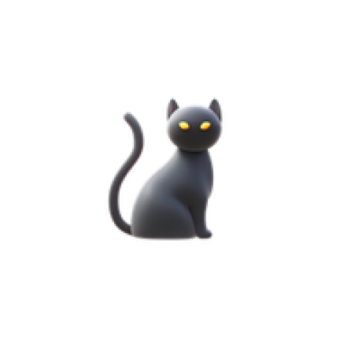

# Moochie

Moochie is a multi-functional Android application that enables seamless communication and notification management between devices.

## Features

### 1. Image Widget
Share and display images between devices using a simple 4-digit code pairing system:
- Upload images from your gallery or take new photos with the camera
- Images are automatically synced across all devices with the same code
- Home screen widget for quick access to shared images

### 2. Chat System
Communicate directly with other Moochie users:
- Real-time messaging using the same 4-digit code pairing system
- Notification alerts for new messages
- Clean, intuitive chat interface

## Getting Started

### Prerequisites
- Android device running Android 7.0 (API level 24) or higher
- Internet connection for syncing data
- Firebase account (for developers who want to fork/modify the app)

### Installation
1. Download the latest APK from [releases](https://github.com/yourusername/moochie/releases)
2. Install the APK on your Android device
3. Grant the required permissions when prompted

### Configuration
1. Open the app and set your 4-digit code
2. Add the Moochie widget to your home screen (optional)

## Permissions

Moochie requires the following permissions:
- `READ_EXTERNAL_STORAGE` / `READ_MEDIA_IMAGES`: To access images from your device
- `CAMERA`: To take new photos
- `INTERNET`: To sync data between devices
- `BIND_NOTIFICATION_LISTENER_SERVICE`: To monitor notifications
- `FOREGROUND_SERVICE`: To maintain notification monitoring service
- `FOREGROUND_SERVICE_DATA_SYNC`: For background data syncing

## Technical Details

### Architecture
- Built using Kotlin and Java
- Firebase Realtime Database for data sync
- Firebase Authentication for secure user identification
- Firebase Cloud Messaging for push notifications
- MVVM architecture pattern

### Components
- **SplashActivity**: Entry point with animation
- **MainActivity**: Central hub for accessing all features
- **ChatActivity**: Real-time messaging interface
- **ImageWidgetProvider**: Home screen widget for quick image viewing
- **MoochieNotificationListenerService**: Background service for notification monitoring

## Contributing

Contributions are welcome! Please feel free to submit a Pull Request.

1. Fork the project
2. Create your feature branch (`git checkout -b feature/amazing-feature`)
3. Commit your changes (`git commit -m 'Add some amazing feature'`)
4. Push to the branch (`git push origin feature/amazing-feature`)
5. Open a Pull Request

## License

This project is licensed under the Unlicense - see the [LICENSE](LICENSE) file for details.

## Contact

Project Link: [https://github.com/jonvicbarcenas/moochie](https://github.com/jonvicbarcenas/moochie)

## Acknowledgments

- [Lottie](https://airbnb.io/lottie/) for beautiful animations
- [Glide](https://github.com/bumptech/glide) for efficient image loading
- [OkHttp](https://square.github.io/okhttp/) for network operations
- Firebase for real-time data sync and authentication